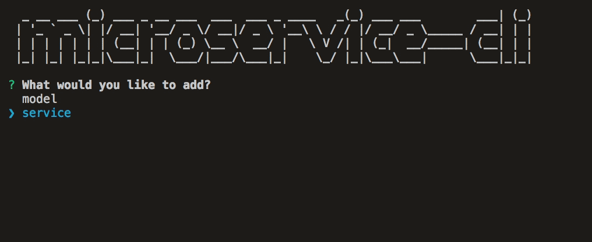

[](https://moleculer.services)


<br/>
<div align="center" >A well-structured Moleculer JS Boilerplate with Typescript, CLI, Service Clients, Swagger, Jest support and everything you'll ever need to deploy rock solid projects.
</div>
<br/>

<div align="center">
  <!-- CodeClimate -->
  <a href="https://codeclimate.com/github/pankod/next-boilerplate/maintainability">
    
  </a>
  <!-- CodeCoverave -->
  <a href="https://codeclimate.com/github/pankod/next-boilerplate/test_coverage"></a>
  <!-- Build Status -->
  <a href="https://travis-ci.org/pankod/next-boilerplate">
    
  </a>
  <!-- Dependency Status -->
  <a href="https://david-dm.org/pankod/moleculerjs-boilerplate">
    
  </a>
  <!-- devDependency Status -->
  <a href="https://david-dm.org/pankod/moleculerjs-boilerplate#info=devDependencies"> 
    
  </a>
</div>


<br/>
<div align="center">
  <sub>Created by <a href="https://www.pankod.com">Pankod</a></sub>
</div>


## About

A microservice is a single self-contained unit which, together with many others, makes up a large application. By splitting your app into small units every part of it is independently deployable and scalable, can be written by different teams and in different programming languages and can be tested individually.

Moleculer is a fast, modern and powerful microservices framework for Node.js. It helps you to build efficient, reliable & scalable services.

This boilerplate make it easier to get started with a well-structured Node.js microservices with Typescript.

<br/>

## Features


This boilerplate includes the latest powerfull tools.

* **Typescript** - Superset of JavaScript which primarily provides optional static typing, classes and interfaces. path support(allias)
* **Built-in Project CLI**- Create services, models, interfaces, and tests with one command by using built-in cli.
* **Docker** - A tool designed to make it easier to create, deploy, and run applications by using containers.
* **Eslint** - The pluggable linting utility.
* **Swagger** - A framework backed by a large ecosystem of tools that helps developers design, build, document, and consume RESTful Web services.
* **Jest** - Javascript testing framework , created by developers who created react
* **TypeORM** - An ORM that converts data between JavaScript / TypeScript to a variety of databases: MySQL / MariaDB / Postgres / SQLite / Microsoft SQL Server / Oracle / sql.js.
* **Service Clients** - Her servisin nasıl kullanılacağına dair protocal yayınlar.
<br/>


## Setup & Documentation

Please refer to our [setup guide](https://pankod.github.io/next-boilerplate/docs/setup) to create a new app. 


For more detailed documentation, check out https://pankod.github.io/next-boilerplate/

<br/>

## Built-in CLI


<div>
 
</div>
<br/>
<br/>

moleculerjs-boilerplate is shipped with a CLI tool to streamline the creation of new microservices. By using the CLI tool, you may easily add models, services to your project and have all the required interfaces and imports are automatically created for you.
<br />

To start the CLI, you may run the following npm command:

```
npm run g
```


After answering questions it generates files in miliseconds.

<br/>

## Tree

 ***You should end up with something similar to this:***
 
 <br/>

```
.
├── project-cli
├── public
│   ├── banner.png
│   ├── favicon.ico
│   └── index.html
├── services
│   ├── api.service.ts
│   ├── index.ts
│   ├── planet.service.ts
│   └── weapon.service.ts
├── src
│   ├── Helper
│   │   ├── Mocks
│   │   │   └── Context.ts
│   │   ├── PlanetHelper.ts
│   │   ├── WeaponHelper.ts
│   │   └── index.ts
│   ├── Interfaces
│   │   ├── Fire
│   │   │   ├── DamageInDto.d.ts
│   │   │   ├── FireInDto.d.ts
│   │   │   ├── FireMethodOutDto.ts
│   │   │   ├── FireOutDto.d.ts
│   │   │   ├── FireResult.d.ts
│   │   │   └── WarMessageOutDto.d.ts
│   │   ├── Planet
│   │   │   ├── DefendOutDto.d.ts
│   │   │   └── PlanetSql.d.ts
│   │   ├── Weapon
│   │   │   └── WeaponSql.d.ts
│   │   └── index.ts
│   ├── Meta
│   │   ├── CalculateMeta.ts
│   │   └── index.ts
│   ├── Models
│   │   ├── Planet.mock.ts
│   │   ├── Planet.ts
│   │   ├── Weapon.mock.ts
│   │   ├── Weapon.ts
│   │   └── index.ts
│   └── Repositories
│       ├── Database.ts
│       ├── Planet.ts
│       ├── Weapon.ts
│       └── index.ts
├── swagger
│   ├── index.js
│   ├── package.json
│   ├── swagger.json
│   └── swagger.yaml
├── swagger.json
├── swaggerConfig.json
├── test
│   ├── config
│   │   ├── Database.ts
│   │   └── mock.setup.js
│   └── unit
│       ├── Helper
│       │   ├── PlanetHelper.spec.ts
│       │   └── WeaponHelper.spec.ts
│       ├── Meta
│       │   └── CalculateMeta.spec.ts
│       ├── MicroServices
│       │   ├── planet.spec.ts
│       │   └── weapon.spec.ts
│       └── Repositories
│           ├── Planet.spec.ts
│           └── Weapon.spec.ts
├── Dockerfile
├── LICENSE
├── README.md
├── db.sqlite.example
├── docker-compose.env
├── docker-compose.yml
├── moleculer.config.ts
├── package-lock.json
├── package.json
├── tsconfig.json
└── tsoa.json

```
 
## License

Licensed under the MIT License, Copyright © 2018-present Pankod
