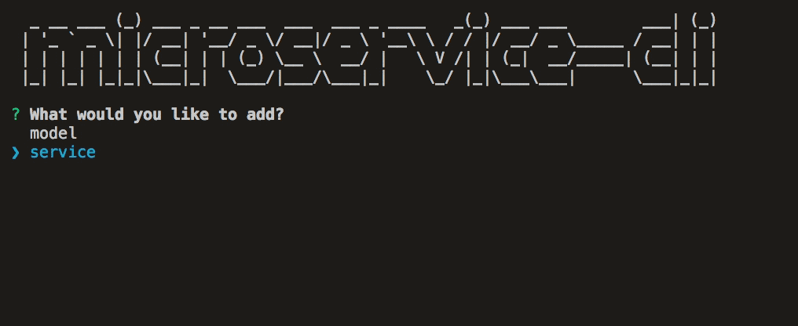

<div>
 
</div>
<br/>
<br/>


moleculerjs-boilerplate is shipped with a CLI tool to streamline the creation of new microservices. By using the CLI tool, you may easily add entities, services, tests to your project and have all the required interfaces and imports are automatically created for you.
<br />

To start the CLI, you may run the following npm command:

```sh
npm run g
```


After answering questions it generates files in miliseconds.
